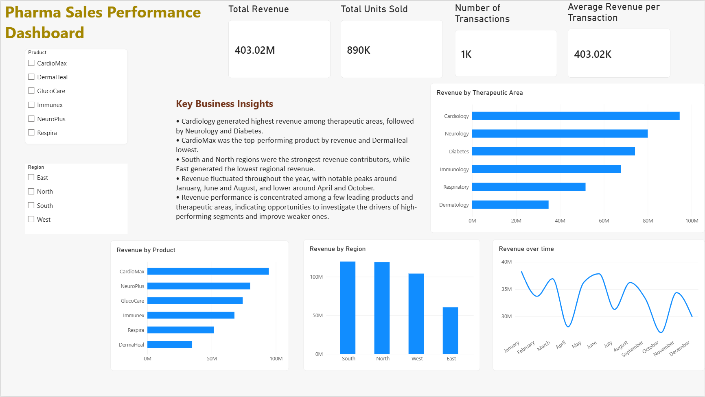

# Pharma Sales Performance Dashboard – Power BI

## Overview

This project is a pharmaceutical sales performance dashboard created using Microsoft Power BI.

The dashboard analyzes sales data across products, therapeutic areas, regions, and time to understand overall revenue performance and identify high- and low-performing areas.

The project was created as a Business Analyst portfolio project to practice data visualization, business analysis, and communicating insights through an interactive dashboard.

## Business Problem

A pharmaceutical company needs a simple way to monitor its sales performance and understand which products, therapeutic areas, and regions are contributing the most to revenue.

A dashboard can help business teams quickly answer questions such as:

- What is the total revenue generated?
- How many units were sold?
- Which therapeutic areas generate the most revenue?
- Which products are performing the best?
- Which regions contribute the most revenue?
- How does revenue change over time?

## Objective

The objective of this project was to:

- Analyze pharmaceutical sales performance.
- Compare revenue across products and therapeutic areas.
- Compare revenue across different regions.
- Analyze revenue trends over time.
- Create an interactive Power BI dashboard.
- Present key business insights in a simple and easy-to-understand format.

## Dataset

The dataset contains pharmaceutical sales records with the following fields:

- Date
- Product
- Therapeutic Area
- Region
- Territory
- Sales Rep
- Units Sold
- Revenue
- Target

The dataset was prepared for this project to practice pharmaceutical sales analysis and Power BI dashboard development.

## Tools Used

- Microsoft Power BI
- Power Query
- Power BI Data Visualization
- Basic DAX measure

## Data Preparation

The dataset was imported into Power BI and checked using Power Query.

The data preparation process included:

- Reviewing the available columns.
- Checking the data structure.
- Checking for completely duplicated rows.
- Checking the data for blank values.
- Loading the cleaned data into Power BI.

No completely identical duplicate rows were found when the full set of columns was checked.

## Dashboard

The dashboard contains the following key metrics:

- Total Revenue
- Total Units Sold
- Number of Transactions
- Average Revenue per Transaction

It also includes:

- Revenue by Therapeutic Area
- Revenue by Product
- Revenue by Region
- Revenue over Time
- Region slicer
- Product slicer
- Key Business Insights

## Key Business Insights

Based on the dashboard:

- Cardiology generated the highest revenue among the therapeutic areas.
- CardioMax was the highest-revenue product among the products analyzed.
- South and North were the strongest regions in terms of revenue.
- East generated the lowest revenue among the four regions.
- Revenue fluctuated throughout the year, with noticeable higher and lower points across different months.
- Revenue performance varied across products and therapeutic areas, highlighting areas that could be investigated further by the business team.

## Business Recommendations

Based on the analysis, the business could:

- Investigate the factors contributing to the strong performance of Cardiology and CardioMax.
- Understand why South and North regions are generating higher revenue.
- Investigate the lower revenue contribution from the East region.
- Analyze the reasons behind weaker-performing products and therapeutic areas.
- Monitor monthly revenue trends to identify periods of stronger or weaker performance.

## Dashboard Preview

## Skills Demonstrated

- Power BI
- Power Query
- Data Cleaning
- Data Visualization
- Dashboard Design
- Basic DAX
- Business Analysis
- KPI Analysis
- Business Insights
- Data-driven Recommendations

## Project Outcome

This project helped me practice transforming sales data into an interactive business dashboard and communicating data-driven findings in a format that can support business decision-making.
